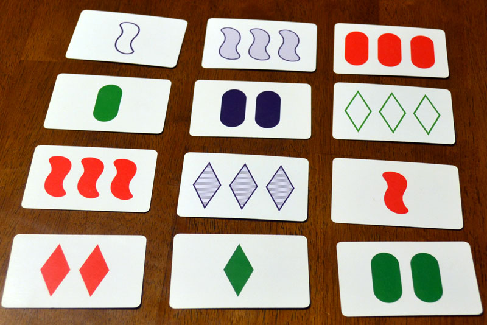

# Project Proposal: **Set_CV**

**13.04.2021, FH Hagenberg, Computer Vision SS 2021**

## Who is on your team?

- [Nikolaus Hofer](mailto:s2010455025@students.fh-hagenberg.at) (S2010455025)
- [Bernhard Mayr](mailto:s2010455011@students.fh-hagenberg.at) (S2010455011)

## What is the problem/question that you will be investigating?

We want to build an application that assists players of the game [**Set**](https://www.setgame.com/set/puzzle).
Set is a puzzle game where the players have to find matching "*Sets*".
Those consist of three cards with either fully divergent or matching features.
The full playing instructions can be found here: [Set Game Instructions](https://www.setgame.com/sites/default/files/instructions/SET%20INSTRUCTIONS%20-%20ENGLISH.pdf).

This is what a Set game board looks like:



Playing a card game does not seem like a problem, but while playing Set there is always the question whether there is currently a Set on the board or not.
Normally one of the more experienced players takes that role and scans the board for leftover sets.
But using computer vision for this task seems like a perfect fit and could really improve the game's experience.

## What data can you use?

We own a copy of the game set, so we can simply capture pictures and videos of it in action.
On top of that [tomwhite/set-game](https://github.com/tomwhite/set-game) provides some sample data sets we can use.

## Did you find existing methods, already? Are their implementations available?

Yes there are already existing solutions with various approaches and technologies.
Those are listed below:

- [zedosoad1995/SetCardGameCV](https://github.com/zedosoad1995/SetCardGameCV) *(C++, OpenCV)*
- [tomwhite/set-game](https://github.com/tomwhite/set-game) *(Python, CNN)*
- [stetelepta/setdetection](https://github.com/stetelepta/setdetection) *(Python, OpenCV + ML)*
- [piratefsh/set-solver](https://github.com/piratefsh/set-solver) *(Python, OpenCV)*

## How will you evaluate your results?

We simply have to evaluate the model's performance in detecting the correct cards, so we can take pictures, code them by hand and then measure the accuracy of our computer vision algorithm.

## Qualitatively, what kind of results do you expect (e.g. plots or figures)

The results we expect is in the shape:

```ts
type ExpectedResult = Array<Card>;
type Card = {
    color: 'red' | 'green' | 'purple';
    shape: 'oval' | 'squiggle' | 'diamond';
    number: 'one' | 'two' | 'three';
    shading: 'solid' | 'striped' | 'outlined';
}
```

This lets us use this data for further processing (How many cards are on the board?, Are there sets?, What are the sets?).

## Quantitatively, what kind of analysis will you use to evaluate and/or compare your results (e.g. what performance metrics or statistical tests)?

The statistics will be a pretty basic relative counting compared to 100% success rate (coded by hand in the test data).

## Further Remarks

We plan to implement this idea as a *PWA on the web*.
Therefore we also plan some time to realize the algorithms without standard OpenCV and integrating computer vision in the web.
We also plan on building some kind of audio-feedback for a kind of "game assistant" based on top of the card extraction.

One more idea of ours regarding the project scope is that **we really want to value algorithm performance**, because we are aware that solutions already exist and this is nothing new, but we want to build it as an example of a *well-done solution*.

### Reference Papers (*for now*)

- [Computer Vision for Card Games](http://cs229.stanford.edu/proj2017/final-reports/5233806.pdf)
- [Optical Game Position Recognition in
the Board Game of Go](http://tomasm.cz/imago_files/go_image_recognition.pdf)

### More Resources

Regarding Set and computer vision there is also a discussion on [reddit](https://www.reddit.com/r/computervision/comments/8oiohh/set_card_game/), one on [Data Science StackExchange](https://datascience.stackexchange.com/questions/28247/using-machine-learning-to-play-the-game-set), and a really thorough blogpost on [medium](https://dganais.medium.com/ready-set-image-recognition-720be22d7051).

The first discussion on reddit led us to the idea of using a *Bag of Words Model*, so we will definitely look into this.
<!-- https://en.wikipedia.org/wiki/Bag-of-words_model_in_computer_vision -->

### Computer Vision on the Web

Regarding Computer Vision on the Web there is definitely some content available, but not as much as on OpenCV.
So we are gonna list some of it here, first for listing additional references and second for a reference of ours.

There are two ([1](https://medium.com/jit-team/how-to-create-a-musical-instrument-with-no-notes-using-javascript-ec6a83333aa4), [2](https://alibaba-cloud.medium.com/computer-vision-on-the-web-with-trackingjs-51faa6c55fda)) pretty good introductory blog articles about this topic.
Possible libraries to use or get inspiration from are:

- [tracking.js](https://trackingjs.com/)
- [jsfeat](https://inspirit.github.io/jsfeat/)
- [GammaCV](https://gammacv.com/)
- [OpenCV.js](https://docs.opencv.org/master/d5/d10/tutorial_js_root.html)

### Open Source

We will do all of our coding publicly on [github:bemayr/set-cv](bemayr/set-cv).

<!-- - https://github.com/sami-badawi/shapelogic-typescript -->
<!-- - https://www.freecodecamp.org/news/computer-vision-js-frameworks-you-need-to-know-b233996103ce/ -->
<!-- - https://bensonruan.com/how-to-access-webcam-and-take-photo-with-javascript/ -->
<!-- - https://webgazer.cs.brown.edu/# -->
